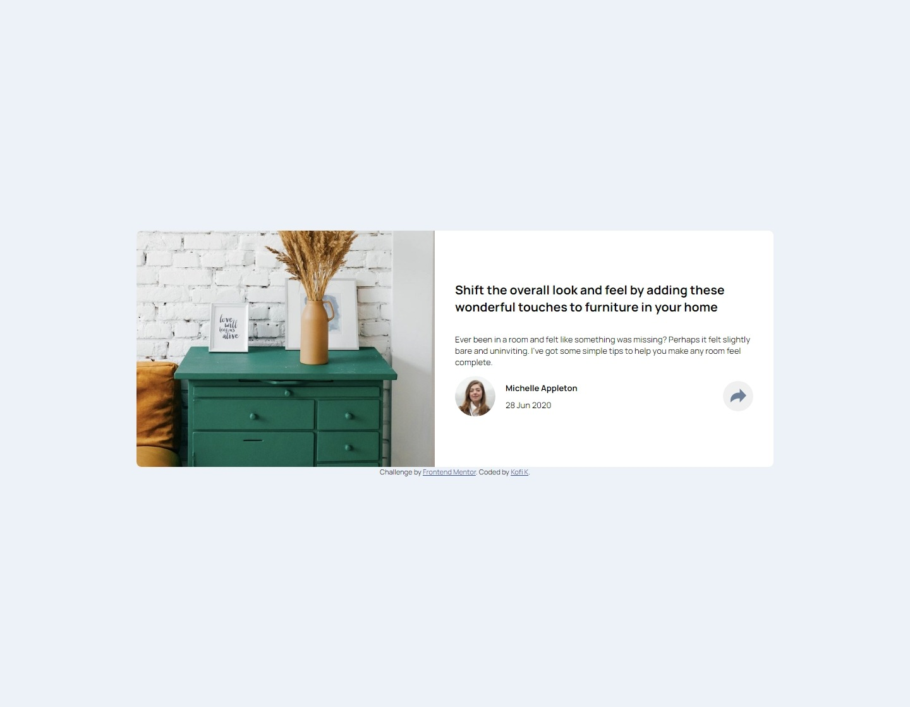
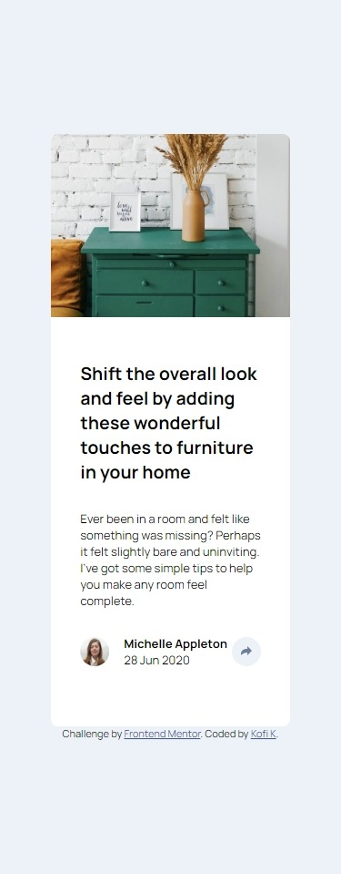
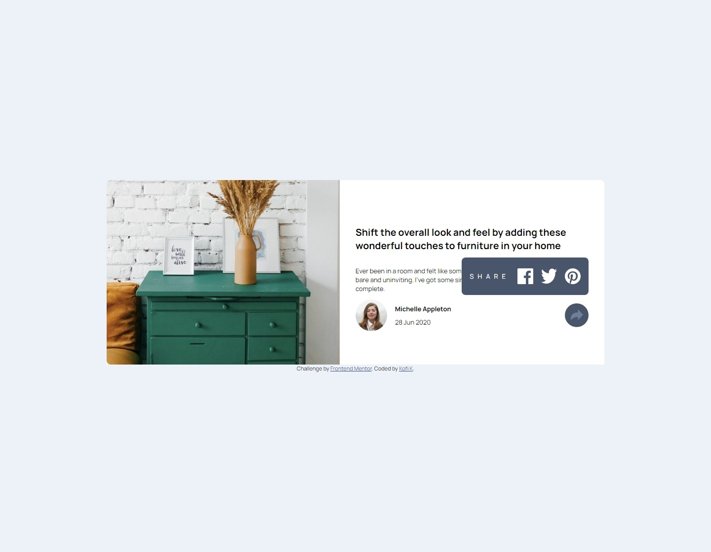
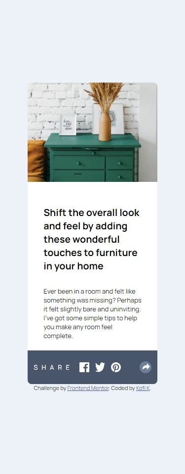

# 3 column preview Card Component

## Project Links

<a href="https://github.com/Kofi100/3-Column-Card-Page-FrontEnd-Mentor"> </a>
<a href="https://kofi100.github.io/product-preview-card/"> </a>
<a href="https://www.frontendmentor.io/solutions/intro-component-using-htmlcssjavascript-HKi0Wx4WRY"></a>

## Introduction

Users should be able to:

- View the `optimal layout` for the component depending on their device's screen size
- See the social media share links when they `click the share icon`

## Screenshots

Desktop and Mobile Views



Active States




## Built with

- HTML
- CSS
- JavaScript

## What I learnt

I learnt how to use position:absolute to place elements on top of another.
I also learnt how to use JavaScript to enable buttons to copy to the clipboard and also relearnt how to make JS detect
whether an element was in another class or not.

For using position: absolute as shown in the code:

```css
/* CSS */
.articlePreview__SocialLinks {
  display: flex;
  align-items: center;
  background-color: var(--VeryDarkGrayishBlue);
  padding: 1rem;
  column-gap: 16px;
  border-radius: 0.5rem;
  color: white;
  /* postion:absolute uses left,right,top and bottom to */
  /* set where the element would be. */
  position: absolute;
  right: 0;
  top: -8vh;
  img {
    height: 32px;
    width: 32px;
  }
}
```

For copying to clipboard:

```javascript
//JS
//copies text to clipboard
var text = "linkTOWebsite";
navigator.clipboard.writeText(text);
```

For checking if an element is in a class or not:

```JavaScript
if (element.classList.contains("classToCheck")){
    //code to implement here.
    //eg. navigator.clipboard.writeText(text);
}
```

# Contacts

<section style="display:flex;align-items:center;column-gap:16px">
<a href="https://github.com/Kofi100"> </a>
<a href="https://www.frontendmentor.io/profile/Kofi100">
</a>
<a href=""></a>
</section>
